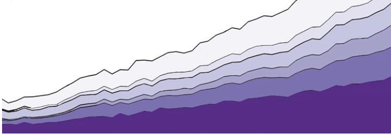

  
```{r setup, include=FALSE}
knitr::opts_chunk$set(echo = FALSE)

#readthedown
library(fontawesome)
library(tidyverse)
library(kableExtra)

# set the seed to keep Hadley's emojis consistent 
# oh! can get dataset with all emojis available + their names
# test <- emo::jis
 
# google fonts
#https://fonts.google.com/

#customizing
#https://rstudio4edu.github.io/rstudio4edu-book/doc-fancy.html
```

```{css, echo=FALSE}

@import url('https://fonts.googleapis.com/css2?family=Poppins:wght@300&display=swap');

body {
    font-family: 'Poppins';
}

h1, h2, h3, h4, h5, h6, legend {
  font-family: 'Poppins';
  color: #39224f
}

#sidebar h2 {
background-color: #39224f !important;
  }

#main a {
color: #39224f !important;
  background-image: linear-gradient(180deg,#438a8f,#438a8f);
}

#main .navbar-nav > .active > a { 
background-color: #39224f !important;
  color: white !important;
}

#main li.active a, li a:hover {
background-color: #39224f !important;
}

code {
  color: #39224f;
}

/*----------------- links ---------------------*/
a { 
  color: #8d80ad !important;
}

a:hover {
 background-color: #39224f !important;
}

/*----------LOGO above TOC---------*/

#TOC::before {
  content: "" !important;
  display: block !important;
  height: 200px !important;
  margin: 20px 20px 40px 20px !important;
  background-image: "img/monachalabi_interethnicmarriages2.png" !important;
  background-size: contain !important;
  background-position: center center !important;
  background-repeat: no-repeat !important;
}
```


```{r}
img_file_names <- c("s2g5-socialjusticepublichealth.png"
                    , "s2g3-publichealth1.jpg"
                    , "s2g2-economics.png"
                    , "s1g6-publichealth.png"
                    , "s1g2-socialjustice.png"
                    , "s1g1-sports.jpeg"
                    , "s2g1-economics-sports.png"
                    , "s2g6-sports.jpg"
                    , "s2g7-politics.jpg"
                    , "S1-politics.jpg"
                    , "s1g4-environment.png"
                    , "s2g4-environment.png"
                    , "temp-sun.png")
                    

blog_link_names <- c("Food-and-PUG-Administration"
                     , "VIVACIOUS-VAXXERS"
                     , "Girls-Who-Code"
                     , "library-cleanverse"
                     , "JAMS"
                     , "Wrangle-This-Messi-Data"
                     , "Lebron-Warrior-Hawks"
                     , "Team-Basketball"
                     , "Election-Pundits"
                     , "Nate-Platinum"
                     , "Team-Save-The-Planet"
                     , "The-Naturers"
                     , "Ava")

template_text <- "Lorem ipsum dolor sit amet, consectetur adipiscing elit, sed do eiusmod tempor incididunt ut labore et dolore magna aliqua. Ut enim ad minim veniam, quis nostrud exercitation ullamco laboris nisi ut aliquip ex ea commodo consequat. Duis aute irure dolor in reprehenderit in voluptate velit esse cillum dolore eu fugiat nulla pariatur. Excepteur sint occaecat cupidatat non proident, sunt in culpa qui officia deserunt mollit anim id est laborum."

table_test <- data.frame(images = paste0("")
                         , title = paste0('<h2 style="font-size:25px;"> [YOUR NIFTY TITLE](https://stat231-s21.github.io/Blog-'
                                         , blog_link_names
                                         , ")</h2>")
                        , text_only = paste0('<p style="color:black;font-size:16px;">',template_text,'</p>')) %>%
  mutate(text = paste(title, text_only, sep="<br>")) %>%
  select(images, text)

#https://www.color-hex.com/color-palette/26632
#colorpal <- c("#ccade1","#745085", "#b1b8c0", "#777a7f", "#8f71b1")
#colorpal <- c("#ede6fb","#cfc3e7","#ae97db", "#805cae","774bb0")
colorpal <- c("774bb0","#ede6fb","774bb0","#ede6fb","774bb0","#ede6fb")
```

<iframe height="950" width="100%" frameborder="no" title="Investigating Social and Emotional Factors During Covid-19" src="https://klingliu.shinyapps.io/blogproject/"> </iframe>

STAT231, Amherst College
<br>
Spring 2021
<br>



# Welcome! `r emo::ji("slightly_smiling_face")` 

Add text

# Blog Posts `r emo::ji("pencil")`

## Food and PUG Administration `r set.seed(15); emo::ji("medicine")`

```{r}
table_test %>%
  filter(str_detect(text, "Food-and-PUG-Administration")) %>%
  kable(col.names=NULL, escape=FALSE) %>%
  column_spec(1:2, width = c("50em","50em")
              , border_left = FALSE
              , border_right = FALSE
              , background = colorpal[1]) %>%
 column_spec(1, link = paste0('https://stat231-s21.github.io/Blog-', blog_link_names[1]))
```

## Vivacious Vaxxers `r set.seed(12); emo::ji("shot")`


```{r}
table_test %>%
  filter(str_detect(text, "VIVACIOUS-VAXXERS")) %>%
  kable(col.names=NULL, escape=FALSE) %>%
  column_spec(1:2, width = c("50em","50em")
              , border_left = FALSE
              , border_right = FALSE
              , background = colorpal[2]) %>%
 column_spec(1, link = paste0('https://stat231-s21.github.io/Blog-', blog_link_names[2]))
```

## Girls Who Code `r set.seed(10); emo::ji("computer")`

```{r}
table_test %>%
  filter(str_detect(text, "Girls-Who-Code")) %>%
  kable(col.names=NULL, escape=FALSE) %>%
  column_spec(1:2, width = c("50em","50em")
              , border_left = FALSE
              , border_right = FALSE
              , background = colorpal[3]) %>%
 column_spec(1, link = paste0('https://stat231-s21.github.io/Blog-', blog_link_names[3]))
```


## library(cleanverse) `r set.seed(1); emo::ji("shower")`

```{r}
table_test %>%
  filter(str_detect(text, "library-cleanverse")) %>%
  kable(col.names=NULL, escape=FALSE) %>%
  column_spec(1:2, width = c("50em","50em")
              , border_left = FALSE
              , border_right = FALSE
              , background = colorpal[4]) %>%
 column_spec(1, link = paste0('https://stat231-s21.github.io/Blog-', blog_link_names[4]))
```

<br> 

## JAMS `r set.seed(5); emo::ji("scales")`

```{r}
table_test %>%
  filter(str_detect(text, "JAMS")) %>%
  kable(col.names=NULL, escape=FALSE) %>%
  column_spec(1:2, width = c("50em","50em")
              , border_left = FALSE
              , border_right = FALSE
              , background = colorpal[5]) %>%
 column_spec(1, link = paste0('https://stat231-s21.github.io/Blog-', blog_link_names[5]))
```

<br>

## Wrangle This Messi Data `r set.seed(10); emo::ji("soccer")`

```{r}
table_test %>%
  filter(str_detect(text, "Wrangle-This-Messi-Data")) %>%
  kable(col.names=NULL, escape=FALSE) %>%
  column_spec(1:2, width = c("50em","50em")
              , border_left = FALSE
              , border_right = FALSE
              , background = colorpal[1]) %>%
 column_spec(1, link = paste0('https://stat231-s21.github.io/Blog-', blog_link_names[6]))
```

<br>


## Lebron Warrior Hawks `r set.seed(6); emo::ji("sports")`

```{r}
table_test %>%
  filter(str_detect(text, "Lebron-Warrior-Hawks")) %>%
  kable(col.names=NULL, escape=FALSE) %>%
  column_spec(1:2, width = c("50em","50em")
              , border_left = FALSE
              , border_right = FALSE
              , background = colorpal[2]) %>%
 column_spec(1, link = paste0('https://stat231-s21.github.io/Blog-', blog_link_names[7]))
```

<br>


## Team Basketball `r set.seed(6); emo::ji("sports")`

```{r}
table_test %>%
  filter(str_detect(text, "Team-Basketball")) %>%
  kable(col.names=NULL, escape=FALSE) %>%
  column_spec(1:2, width = c("50em","50em")
              , border_left = FALSE
              , border_right = FALSE
              , background = colorpal[3]) %>%
 column_spec(1, link = paste0('https://stat231-s21.github.io/Blog-', blog_link_names[8]))
```

<br>

## Election Pundits `r set.seed(54); emo::ji("chart decreasing")`

```{r}
table_test %>%
  filter(str_detect(text, "Election-Pundits")) %>%
  kable(col.names=NULL, escape=FALSE) %>%
  column_spec(1:2, width = c("50em","50em")
              , border_left = FALSE
              , border_right = FALSE
              , background = colorpal[4]) %>%
 column_spec(1, link = paste0('https://stat231-s21.github.io/Blog-', blog_link_names[9]))
```

<br>

## Nate Platinum `r set.seed(21); emo::ji("look")`


```{r}
table_test %>%
  filter(str_detect(text, "Nate-Platinum")) %>%
  kable(col.names=NULL, escape=FALSE) %>%
  column_spec(1:2, width = c("50em","50em")
              , border_left = FALSE
              , border_right = FALSE
              , background = colorpal[5]) %>%
 column_spec(1, link = paste0('https://stat231-s21.github.io/Blog-', blog_link_names[10]))
```

<br>


## Team Save the Planet `r set.seed(2021); emo::ji("earth")`

```{r}
table_test %>%
  filter(str_detect(text, "Team-Save-The-Planet")) %>%
  kable(col.names=NULL, escape=FALSE) %>%
  column_spec(1:2, width = c("50em","50em")
              , border_left = FALSE
              , border_right = FALSE
              , background = colorpal[1]) %>%
 column_spec(1, link = paste0('https://stat231-s21.github.io/Blog-', blog_link_names[11]))
```

<br>


## The Naturers `r set.seed(5); emo::ji("tree")`


```{r}
table_test %>%
  filter(str_detect(text, "The-Naturers")) %>%
  kable(col.names=NULL, escape=FALSE) %>%
  column_spec(1:2, width = c("50em","50em")
              , border_left = FALSE
              , border_right = FALSE
              , background = colorpal[2]) %>%
 column_spec(1, link = paste0('https://stat231-s21.github.io/Blog-', blog_link_names[12]))
```

<br>

## Ava `r set.seed(2023); emo::ji("sun")`


```{r}
table_test %>%
  filter(str_detect(text, "Blog-Ava")) %>%
  kable(col.names=NULL, escape=FALSE) %>%
  column_spec(1:2, width = c("50em","50em")
              , border_left = FALSE
              , border_right = FALSE
              , background = colorpal[3]) %>%
 column_spec(1, link = paste0('https://stat231-s21.github.io/Blog-', blog_link_names[13]))
```

<br>

# Resources `r emo::ji("books")`

<ul>
  <li> Design at top of page is taken from an image created by [Mona Chalabi](https://monachalabi.com/) </li>
  <li> Font is Poppins from [Google fonts](https://fonts.google.com/) </li>
  <li> Emojis included via the [`emo` R package](https://github.com/hadley/emo) <br>
          Check out the emojis available: `r emo::jis %>% select(group, subgroup, name, emoji,keywords,aliases) %>% DT::datatable(filter='top',options = list(pageLength = 5, dom = 'tip'))`</li>
</ul>

